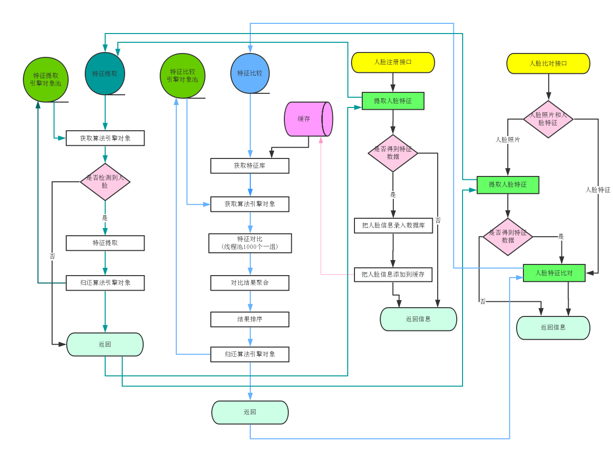

## 开发环境准备：
###开发使用到的软件和工具：
* Jdk8、mysql5.7、libarcsoft_face.dll(so)、libarcsoft_face_engine.dll(so)、libarcsoft_face_engine_jni.dll(so)、idea
* 注：libarcsoft_face.dll(so)、libarcsoft_face_engine.dll(so)、libarcsoft_face_engine_jni.dll(so)、app-id、sdk-key可以到虹软官网 http://ai.arcsoft.com.cn/ 免费申请下载

* 本地配置：
	* 配置环境(推荐jdk8，mysql5.7，maven3，idea)
    * 引擎库libarcsoft_face、libarcsoft_face_engine、libarcsoft_face_engine_jni。把dll或so文件拷贝到java.library.path所包含的路径下,注意区分X86和X64，和当前jdk版本一致。
  
* 初始化项目
创建数据库arcsoft_face_demo，执行脚本arcsoft_face_demo.sql

* 使用idea启动项目
    * 修改配置文件src\main\resources\application.properties
        * 填写数据库地址：spring.datasource.druid.url
        * 填写数据库用户名：spring.datasource.druid.username
        * 填写数据库密码：spring.datasource.druid.password
        * 填写人脸识别id：config.freesdk.app-id
        * 填写人脸识别key：config.freesdk.sdk-key

 
* 启动项目
    * 右键Application，选择Run ‘Application’
 

* 项目访问地址
    * http://127.0.0.1:8080/demo

### 更详细的流程参考：

### 项目流程图
 

### 开源的人脸识别系统
* 开发文档中写着 需要Jdk8、mysql5.7 而我的 mysql 是 8.0 没有任何问题
* 创建好数据库和数据库中的表之后 就可以进行配置了 其中注意的是 要把 arcsoft_lib.zip 这个压缩包 解压到D盘根目录下面或者另外选择一个位置也可以 只不过要在 application.properties 中进行配置 主要配置的有以下几项
~~~yml
# druid
spring.datasource.druid.url=jdbc:mysql://127.0.0.1:3307/arcsoft_face_demo?useUnicode=true&characterEncoding=utf-8&useSSL=false&serverTimezone=UTC # 就配置好相应的 数据库服务端口号和 数据库名称就行
spring.datasource.druid.username=root  # 数据库用户名
spring.datasource.druid.password=admin # 数据库访问密码

# 配置 arcsoft_lib.zip的位置
# 将压缩包解压 
config.arcface-sdk.sdk-lib-path=d:/arcsoft_lib # 后面的路径可以随意修改

# 这里配置服务启动的端口号 如果有进程 占用就修改一下
server.port=8081 

~~~
* 项目启动后的访问地址
  [http://localhost:8081/demo](http://localhost:8081/demo)